# Como Adicionar um Disco e Particionar no Linux

Este tutorial orientará você a adicionar um disco extra à sua máquina virtual Linux no VirtualBox, criar uma partição primária, formatá-la em ext4, montá-la no sistema e configurar a montagem automática durante o boot.

## Passo 1: Adicionar um Disco Extra no VirtualBox

1. Inicie o VirtualBox e certifique-se de que sua máquina virtual (VM) esteja desligada.
2. Selecione sua VM e clique em "Configurações" (Settings).
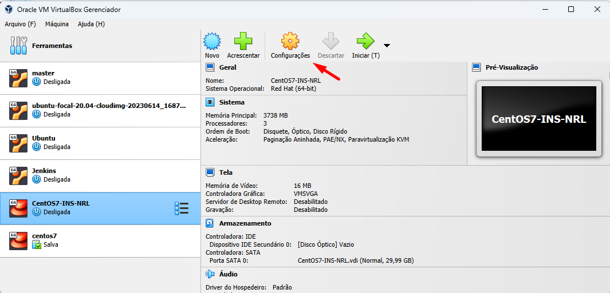
3. Na seção "Armazenamento", clique em OK.
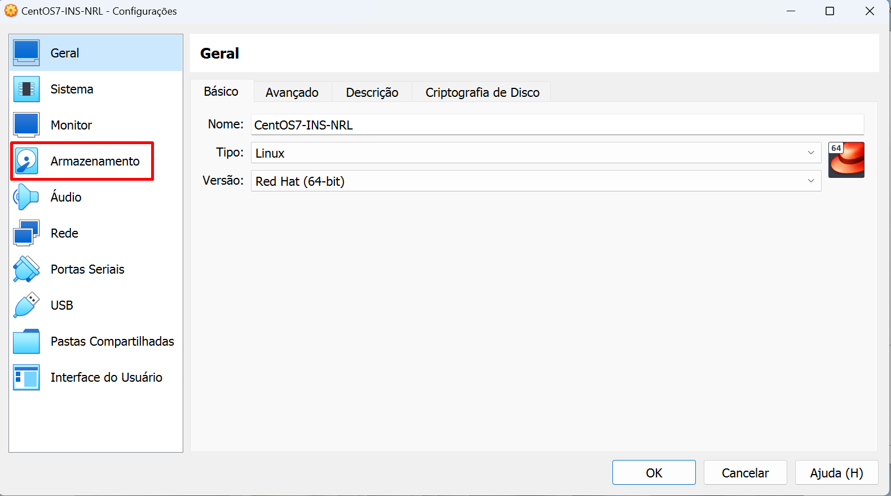
4. Clique na opção "Controladora SATA" e escolha "Adicionar disco rígido virtual" (Add Hard Disk).
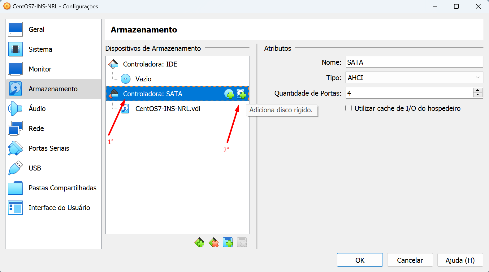
5. Clique na opção criar.
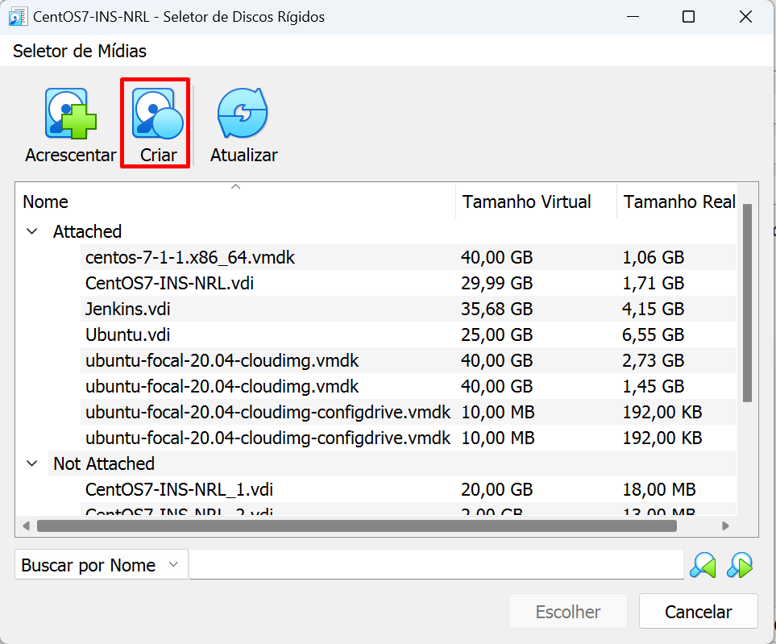
6. No tipo de arquivo de disco rígido, mantenha marcada a opção VDI (Virtual Disk Image), clique em Próximo.
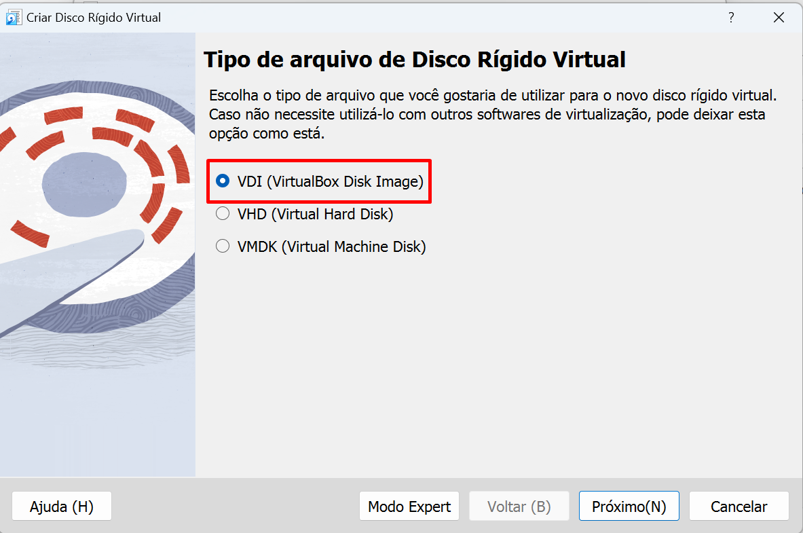
7. No armazenamento em disco rígido físico, não iremos nós aprofundar, apenas clique em Próximo.
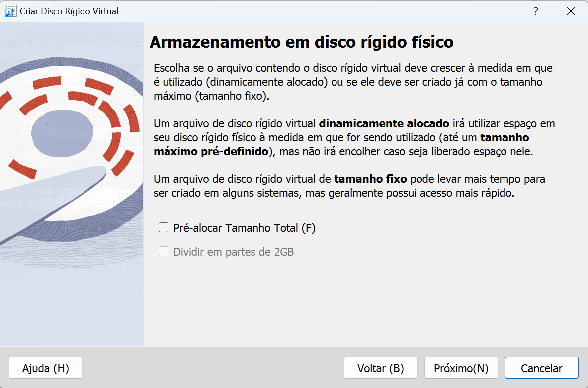
8. Para o tamanho do disco utilizaremos 20GB.
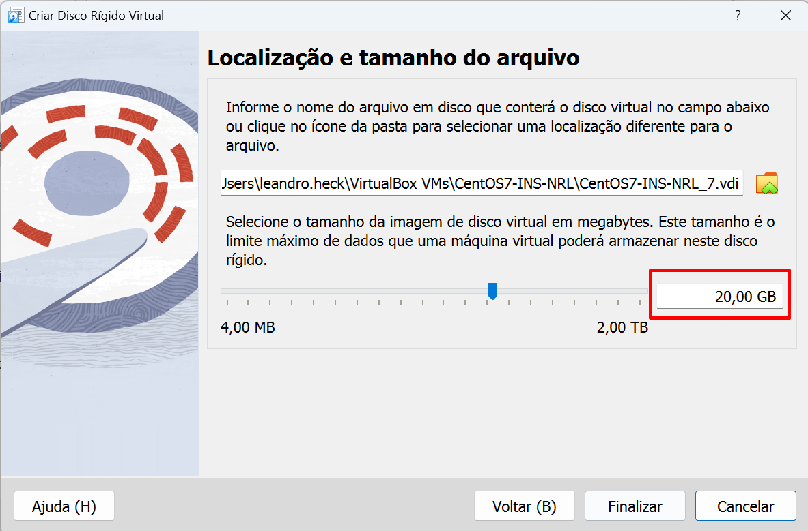
9. Faça o mesmo procedimento para criar mais um disco, seguindo da etapa 4 até a 8. Então teremos dois discos, cada um com o armazenamento de 20 GB.
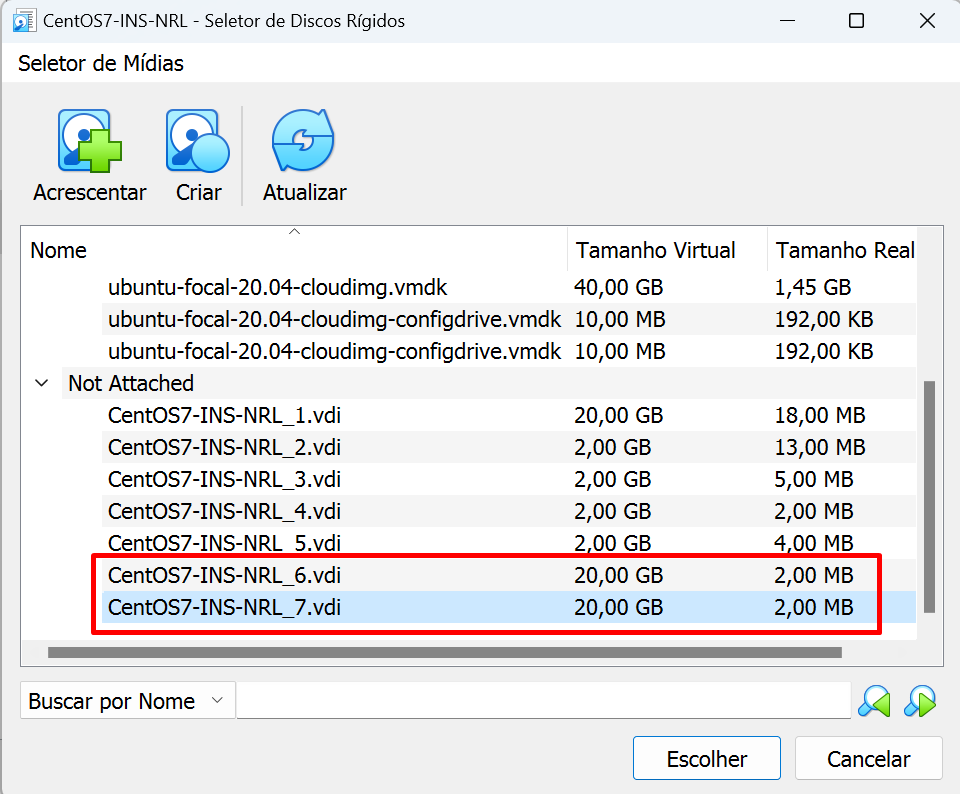
10. Selecione o primeiro disco que criamos, e clique em Acrescentar.
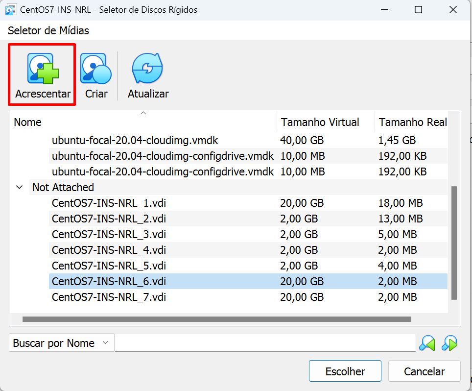
11. Faça o mesmo procedimento para o segundo disco criado.

12. Assim teremos os discos atrelados a nossa Máquina Virtual, para finalizar clique em OK.
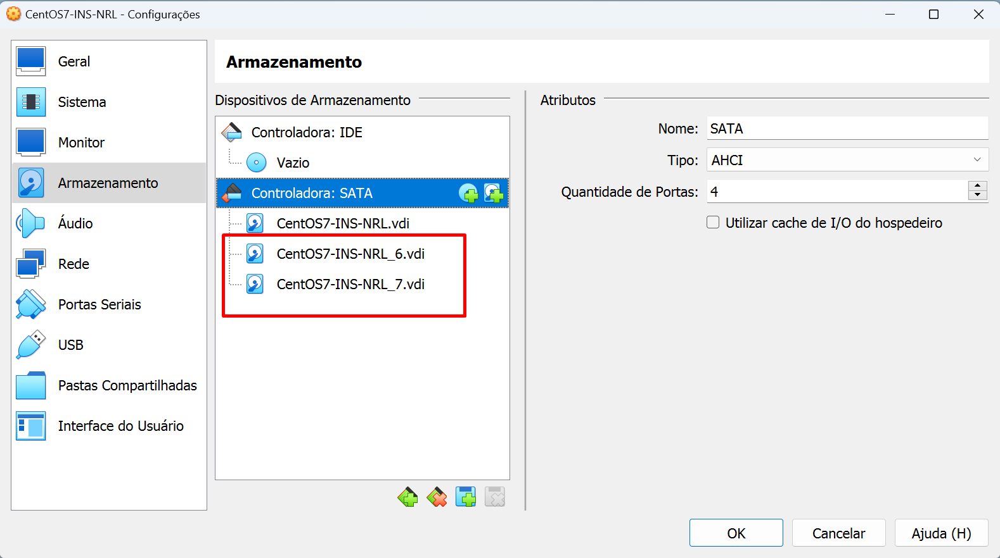

## Passo 2: Criar uma Partição Primária

1. Inicie sua VM e abra um terminal.

2. Digite o seguinte comando para listar os discos disponíveis:
```bash
sudo fdisk -l
```

É possível identificar que a máquina possui dois novos discos /dev/sdb e /dev/sdc.

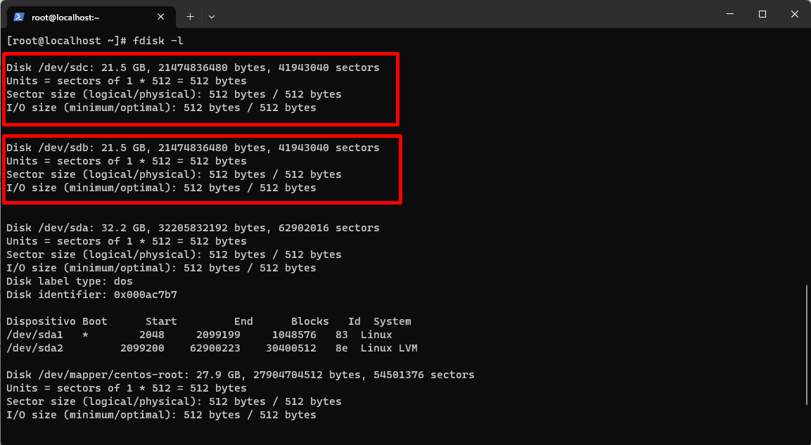

3. Iremos criar duas novas partições, utilzando os discos que atachamos a Máquina Virtual, utilitário fdisk:

```bash
$ sudo fdisk /dev/sdb
```
No prompt do fdisk, siga estas etapas:

Pressione n para criar uma nova partição.
Escolha a opção padrão para partição primária, pressionando Enter.
Pressione Enter para aceitar o primeiro setor padrão.
Digite +1G para especificar o tamanho da partição como 1GB.
Pressione w para salvar as alterações e sair.
Pressione q para sair do fdisk.

## Passo 3: Formatar a Partição e Obter o UUID

1. Formate a nova partição em ext4 (ou xfs, se preferir):

```bash
$ sudo mkfs.ext4 /dev/sdb1
```
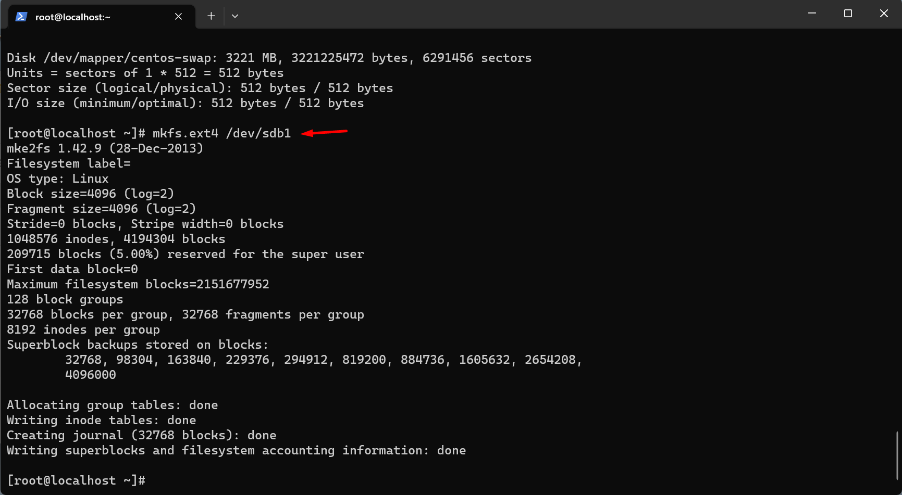
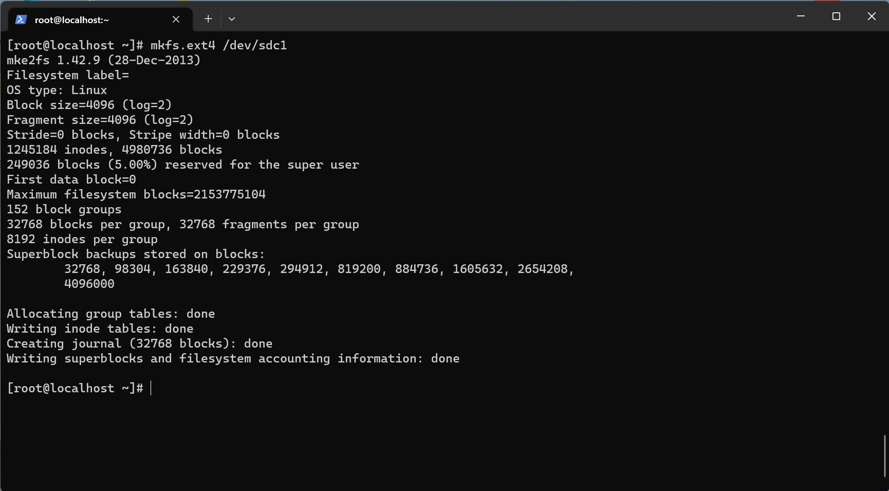
2. Obtenha o UUID da partição recém-formatada:

```bash
$ sudo blkid | grep sdb1
```

Anote o UUID resultante, você precisará dele mais tarde.
